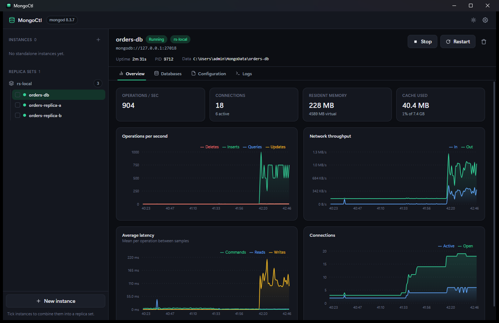

<div align="center">


# MongoCtl

**Local MongoDB, one click away.**

Create, start, stop and monitor MongoDB servers on Windows — and turn any group of
them into a working replica set without writing a line of configuration.

</div>



## Why this exists

Running a second MongoDB on another port means writing a config file, picking a data
directory and starting `mongod` from a terminal. Getting a **replica set** — which you
need for transactions and change streams — means doing that three times and remembering
`rs.initiate()` with the right member document.

Compass browses data. It does not start servers. MongoCtl is the missing piece: a
process manager for local MongoDB, built for throwaway test environments.

## Features

- **One-click lifecycle** — create, start, stop and restart servers, each with its own
  port and data directory. Ports are allocated automatically around whatever is in use.
- **Replica sets by selection** — tick two or more instances and click once. MongoCtl
  enables replication, restarts the members, runs `replSetInitiate` and waits for a
  primary to be elected.
- **Live monitoring** — operations, network throughput, latency, connections, memory and
  WiredTiger cache, sampled every second. Rates are real deltas, and a server restart
  breaks the line instead of drawing a spike that never happened.
- **Full configuration** — edit any server's `mongod.conf` directly. Comments, key order
  and settings MongoCtl knows nothing about all survive the round trip.
- **Data directory control** — set where new instances live, or move an existing
  server's files to another drive, free-space check included.
- **Windows service integration** — start, stop and reconfigure the MongoDB service that
  the official installer registers, alongside your own instances.
- **No orphans, ever** — every server MongoCtl starts belongs to a Windows job object.
  If the app crashes or is killed, the kernel terminates them too, so nothing is left
  holding a port or a data lock.

## Install

Download `MongoCtl.exe` from the [latest release](../../releases/latest) and run it.

That is the entire installation. One file, no installer, no unpacking, and nothing
written outside your user profile.

### Requirements

| | |
| --- | --- |
| **Windows** | 10 or 11, 64-bit |
| **MongoDB** | Community Server — installed separately |
| **WebView2** | Included in Windows 11; Windows 10 may need the [runtime](https://developer.microsoft.com/microsoft-edge/webview2/) |

> **MongoCtl does not bundle MongoDB.** It manages the `mongod` already on your machine,
> found automatically under `C:\Program Files\MongoDB\Server`. If none is installed the
> app says so on its Settings screen and links to the download.

### If Windows blocks it

The released binary is not code-signed, so Windows may get in the way:

- **SmartScreen** — "Windows protected your PC" → *More info* → *Run anyway*.
- **Smart App Control** — blocks unsigned executables outright, with no per-app
  override. It can only be switched off entirely (Windows Security → App & browser
  control), and **that cannot be undone without resetting Windows.** Building from
  source does not help: a freshly compiled binary is equally unsigned.

## Using it

**Create a server.** Click *New instance*, give it a name, accept the suggested port.
It gets its own folder under your data directory and a real `mongod.conf` you can edit.

**Connect to it** at `mongodb://127.0.0.1:<port>` — from your app, `mongosh`, or Compass.

**Watch it.** The Overview tab charts what the server is actually doing, once a second.
The Logs tab streams `mongod`'s structured output with severity filtering.

## Replica sets

Tick two or more instances in the sidebar and click *Group into a replica set*. One
click, no configuration.

There is one thing the app will not hide from you: **every member restarts.** `mongod`
reads `replication.replSetName` only at startup, so a running standalone cannot be
promoted in place. MongoCtl stops each member, writes the setting, starts them again,
initiates the set and waits for the election — showing each step as it happens.

Members other than the first must start with an **empty data directory**, because a new
member copies its data from the primary during initial sync. MongoCtl detects existing
data and offers to clear it. The first instance you select is the seed and keeps its own.

Three members is the sensible default; an even number leaves no majority when one member
goes down, and the app warns you about it.

## The Windows service, and elevation

Instances MongoCtl creates run as ordinary child processes. They never prompt for
anything.

The MongoDB service registered by the official installer is different: starting, stopping
or editing its configuration needs administrator rights, so those actions raise a UAC
prompt.

MongoCtl handles this by **re-launching itself** with a flag that performs one operation
and exits. There is no resident privileged process, no helper binary to distribute, and
no IPC channel for anything to talk to. The elevated side also refuses to accept a
destination path — it reads the target from the service registration itself, so it cannot
be aimed at another file.

## Where things are stored

| | |
| --- | --- |
| Instance registry | `%APPDATA%\MongoCtl\state.json` |
| Server logs | `%LOCALAPPDATA%\MongoCtl\logs` |
| Databases | your chosen data directory (default `%USERPROFILE%\MongoData`) |

Each server's authoritative configuration is a plain `mongod.conf` inside its own data
directory. It stays readable — and usable — without MongoCtl.

## Building from source

Needs Go 1.25+, Node.js 20+ and the Wails v2 CLI.

```bash
go install github.com/wailsapp/wails/v2/cmd/wails@latest

wails dev      # hot-reloading development build
wails build    # produces build/bin/MongoCtl.exe
go test ./...  # unit tests
```

### Releases

Every push to `master` runs the tests, builds the binary and publishes it, together
with a SHA-256 checksum, through [`.github/workflows/release.yml`](.github/workflows/release.yml).

The release is named after `info.productVersion` in `wails.json`. Pushing again without
changing it refreshes the assets on the existing release; bumping it starts a new one.

### Layout

```
main.go                    entry point; also the privileged-operation mode
internal/app/              services bound to the UI — the only Wails-aware package
internal/supervisor/       mongod process lifecycle and readiness
internal/metrics/          serverStatus sampling, rate derivation, ring buffer
internal/replicaset/       replSetInitiate and cluster status
internal/mongoconf/        comment-preserving mongod.conf reader/writer
internal/winsys/           job objects, port probing, service control
internal/elevate/          UAC launch and the operations it performs
frontend/                  React + TypeScript + Tailwind
```

Only `internal/app` imports the Wails runtime; everything below it is plain Go, so the
domain logic is testable without a UI and portable to another shell.

## Status

Built and verified on Windows 11 with MongoDB 8.3. The replica set path is tested end to
end — a multi-document transaction and a change stream both run against a set created by
the app, which is the real proof that the cluster works rather than merely looking right.
